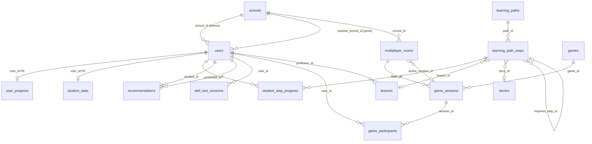

# DELFy API — Référence Backend : Tables, Rôles & Méthodes

> **Projet :** `education_fr_api`  
> **Version API :** 0.2.0  
> **Stack :** FastAPI · PostgreSQL · SQLAlchemy 2.0 · JWT (HS256)

Ce document décrit **chaque table PostgreSQL**, **le rôle de chaque champ**, **les rôles utilisateurs** et **chaque endpoint HTTP** exposé par l'API.

---

## Table des matières

1. [Vue d'ensemble](#1-vue-densemble)
2. [Modèle de rôles et accès](#2-modèle-de-rôles-et-accès)
3. [Schéma relationnel](#3-schéma-relationnel)
4. [Tables et champs (détail)](#4-tables-et-champs-détail)
5. [Référence des endpoints API](#5-référence-des-endpoints-api)
6. [Services métier (couche application)](#6-services-métier-couche-application)
7. [Constantes domaine](#7-constantes-domaine)

---

## 1. Vue d'ensemble

L'API DELFy gère une plateforme d'apprentissage du français pour élèves tunisiens (2ème → 9ème année). Elle couvre :

| Domaine | Description |
|---|---|
| **Authentification** | Inscription élève, login unifié (élève / prof / admin / école), reset mot de passe |
| **Contenu pédagogique** | Leçons, quiz, histoires |
| **Parcours DELF** | Chemins d'apprentissage par niveau scolaire avec étapes verrouillables |
| **Tests DELF** | Évaluation diagnostique par catégories (Grammaire, Conjugaison, etc.) |
| **Multijoueur** | Salles de jeu créées par les profs, sessions quiz en temps réel |
| **Institutions** | Écoles, professeurs, recommandations pédagogiques |
| **Administration** | CRUD complet via le dashboard web Angular |

**Architecture :** Clean Architecture — `Presentation (routers)` → `Application (services)` → `Domain (entities/ports)` → `Infrastructure (ORM/repos)`.

---

## 2. Modèle de rôles et accès

### 2.1 Types de comptes

| Rôle / Token | Stocké dans | Description |
|---|---|---|
| **`user`** (élève) | `users.role = 'user'` | App mobile Flutter — parcours, quiz, multijoueur, test DELF |
| **`prof`** (professeur) | `users.role = 'prof'` | Dashboard prof — élèves, leçons, salles multijoueur, recommandations |
| **`admin`** | `users.role = 'admin'` | Dashboard admin Angular — gestion globale de la plateforme |
| **`school`** | Token JWT `school:{uuid}` | Dashboard école — profils élèves/profs de l'établissement |

### 2.2 Guards FastAPI (`app/api/dependencies.py`)

| Guard | Rôles autorisés | Usage |
|---|---|---|
| `get_current_user` | Tout utilisateur JWT valide et actif | Endpoints génériques authentifiés |
| `get_current_school` | Compte école JWT | Routes `/school/*` |
| `get_current_account` | Utilisateur **ou** école | Changement de mot de passe unifié |
| `require_admin` | `admin` uniquement | Routes `/admin/*` |
| `require_prof` | `prof`, `admin` | Routes `/prof/*` |
| `require_student` | `user`, `admin` | Parcours, tests DELF |
| `require_player` | `user`, `prof`, `admin` | Multijoueur |

### 2.3 Matrice d'accès simplifiée

```
                    Public  Élève  Prof  Admin  École
/auth/register        ✓
/auth/login           ✓
/content/*                     ✓      ✓     ✓
/progress/*                    ✓            ✓
/parcours/*                    ✓            ✓
/delf-tests/*                  ✓            ✓
/multiplayer/*                 ✓      ✓     ✓
/prof/*                               ✓     ✓
/school/*                                    ✓
/admin/*                                      ✓
/health               ✓
```

---

## 3. Schéma relationnel



**17 tables** au total (voir section 4).

---

## 4. Tables et champs (détail)

---

### 4.1 `users` — Comptes utilisateurs (élèves, profs, admins)

**Rôle de la table :** Stocke tous les comptes personnes physiques. Un même email peut coexister avec un compte école si les mots de passe diffèrent (login unifié).

| Champ | Type | Contraintes | Commentaire |
|---|---|---|---|
| `id` | UUID | PK, auto-généré | Identifiant unique du compte |
| `email` | VARCHAR(320) | UNIQUE, NOT NULL, indexé | Adresse e-mail de connexion |
| `password_hash` | TEXT | NOT NULL | Mot de passe haché (bcrypt) — jamais exposé en API |
| `first_name` | VARCHAR(255) | NOT NULL | Prénom affiché dans l'app |
| `last_name` | VARCHAR(255) | NOT NULL | Nom de famille |
| `level` | VARCHAR(128) | NOT NULL | Niveau pédagogique général (ex. `debutant`, `intermediaire`, `avance`) — utilisé pour le scoring multijoueur |
| `class_level` | VARCHAR(16) | NULL | Niveau scolaire tunisien (ex. `6ème année`) — détermine le parcours DELF et le test diagnostique |
| `phone` | VARCHAR(32) | NULL | Numéro de téléphone (optionnel) |
| `date_of_birth` | DATE | NULL | Date de naissance (optionnel) |
| `role` | VARCHAR(32) | NOT NULL, défaut `user` | Rôle : `user` \| `prof` \| `admin` |
| `must_change_password` | BOOLEAN | NOT NULL, défaut `false` | Force le changement de mot de passe à la première connexion (comptes créés par admin/école) |
| `is_active` | BOOLEAN | NOT NULL, défaut `true` | `false` = compte désactivé (connexion refusée) |
| `created_at` | TIMESTAMPTZ | NOT NULL | Date de création du compte |
| `school_id` | UUID | FK → `schools.id`, NULL, ON DELETE SET NULL | École de l'élève (inscription) |
| `teacher_school_id` | UUID | FK → `schools.id`, NULL, ON DELETE SET NULL | École du professeur |

**Relations :** `user_progress`, `student_stats`, `student_step_progress`, `recommendations`, `delf_test_sessions`, `game_participants`, `lessons` (via `professor_id`).

---

### 4.2 `schools` — Établissements scolaires

**Rôle de la table :** Comptes institutionnels autonomes (login séparé via JWT `school:{id}`). Gèrent leurs élèves et professeurs.

| Champ | Type | Contraintes | Commentaire |
|---|---|---|---|
| `id` | UUID | PK | Identifiant de l'établissement |
| `name` | VARCHAR(512) | NOT NULL | Nom officiel de l'école |
| `address` | VARCHAR(512) | NULL | Adresse postale |
| `city` | VARCHAR(255) | NULL | Ville |
| `postal_code` | VARCHAR(32) | NULL | Code postal |
| `phone` | VARCHAR(64) | NULL | Téléphone de l'établissement |
| `email` | VARCHAR(320) | UNIQUE, NOT NULL, indexé | E-mail de connexion du compte école |
| `password_hash` | TEXT | NOT NULL | Mot de passe haché |
| `director_name` | VARCHAR(255) | NULL | Nom du directeur / responsable |
| `must_change_password` | BOOLEAN | NOT NULL, défaut `false` | Changement obligatoire à la première connexion |
| `is_active` | BOOLEAN | NOT NULL, défaut `true` | Désactivation du compte école |
| `created_at` | TIMESTAMPTZ | NOT NULL | Date de création |
| `created_by_admin_id` | UUID | FK → `users.id`, NULL | Admin ayant créé l'établissement |

**Relations :** élèves (`users.school_id`), professeurs (`users.teacher_school_id`), salles multijoueur.

---

### 4.3 `lessons` — Leçons pédagogiques

**Rôle de la table :** Contenu textuel structuré par catégorie et niveau. Peut être créé par un admin ou un prof (via `professor_id`).

| Champ | Type | Contraintes | Commentaire |
|---|---|---|---|
| `id` | UUID | PK | Identifiant de la leçon |
| `title` | VARCHAR(512) | NOT NULL | Titre affiché dans l'app |
| `content` | TEXT | NOT NULL | Corps de la leçon (HTML/Markdown) |
| `category` | VARCHAR(128) | NOT NULL | Catégorie : Grammaire, Conjugaison, Orthographe, Vocabulaire, Lecture, Dictée |
| `level` | VARCHAR(128) | NOT NULL | Niveau cible (aligné sur `class_level` ou abréviation) |
| `sort_order` | INTEGER | NOT NULL, défaut 0 | Ordre d'affichage dans une liste |
| `professor_id` | UUID | FK → `users.id`, NULL | Prof auteur (NULL = contenu admin global) |
| `created_at` | TIMESTAMPTZ | NOT NULL | Date de création |

**Utilisée par :** étapes de parcours (`learning_path_steps.lesson_id`), consultation mobile `/lessons`.

---

### 4.4 `quiz_questions` — Banque de questions QCM

**Rôle de la table :** Questions à choix multiples pour quiz, parcours, tests DELF et multijoueur.

| Champ | Type | Contraintes | Commentaire |
|---|---|---|---|
| `id` | UUID | PK | Identifiant de la question |
| `question` | TEXT | NOT NULL | Énoncé de la question |
| `options` | JSONB | NOT NULL | Tableau de chaînes — les choix de réponse |
| `correct_index` | INTEGER | NOT NULL | Index (0-based) de la bonne réponse dans `options` |
| `explanation` | TEXT | NULL | Explication affichée après la réponse |
| `category` | VARCHAR(128) | NOT NULL | Catégorie : Grammaire, Conjugaison, Orthographe, Vocabulaire |
| `level` | VARCHAR(128) | NOT NULL | Niveau de difficulté / classe |

**Utilisée par :** parcours (étapes quiz), test DELF, sessions multijoueur.

---

### 4.5 `stories` — Histoires / lectures

**Rôle de la table :** Contenu narratif pour les étapes « story » du parcours.

| Champ | Type | Contraintes | Commentaire |
|---|---|---|---|
| `id` | UUID | PK | Identifiant de l'histoire |
| `title` | VARCHAR(512) | NOT NULL | Titre |
| `content` | TEXT | NOT NULL | Texte de l'histoire |
| `level` | VARCHAR(128) | NOT NULL | Niveau scolaire cible |
| `audio_url` | TEXT | NULL | URL optionnelle d'un fichier audio (lecture à voix haute) |
| `created_at` | TIMESTAMPTZ | NOT NULL | Date de création |

---

### 4.6 `user_progress` — Progression legacy (JSON)

**Rôle de la table :** Stocke la progression « classique » de l'élève (leçons complétées, scores quiz/exercices) sous forme JSON flexible. Complémentaire au parcours structuré.

| Champ | Type | Contraintes | Commentaire |
|---|---|---|---|
| `user_id` | UUID | PK, FK → `users.id`, ON DELETE CASCADE | Un enregistrement par élève |
| `data` | JSONB | NOT NULL, défaut `{}` | Structure : `{ lessonsCompleted: string[], quizScores: {cat: number[]}, exerciseScores: {cat: number[]} }` |

**Endpoints :** `GET/PUT /progress`.

---

### 4.7 `recommendations` — Recommandations prof → élève

**Rôle de la table :** Messages pédagogiques personnalisés laissés par un professeur pour un élève.

| Champ | Type | Contraintes | Commentaire |
|---|---|---|---|
| `id` | UUID | PK | Identifiant |
| `student_id` | UUID | FK → `users.id`, NOT NULL, indexé, ON DELETE CASCADE | Élève destinataire |
| `professor_id` | UUID | FK → `users.id`, NULL, indexé, ON DELETE SET NULL | Professeur auteur |
| `content` | TEXT | NOT NULL | Texte de la recommandation |
| `created_at` | TIMESTAMPTZ | NOT NULL | Date d'envoi |

---

### 4.8 `contact_messages` — Messages du formulaire de contact

**Rôle de la table :** Messages reçus depuis le site public, consultables par l'admin.

| Champ | Type | Contraintes | Commentaire |
|---|---|---|---|
| `id` | UUID | PK | Identifiant |
| `name` | VARCHAR(255) | NOT NULL | Nom de l'expéditeur |
| `email` | VARCHAR(320) | NOT NULL, indexé | E-mail de contact |
| `subject` | VARCHAR(512) | NOT NULL | Objet du message |
| `message` | TEXT | NOT NULL | Corps du message |
| `read` | BOOLEAN | NOT NULL, défaut `false` | Marqué comme lu par l'admin |
| `created_at` | TIMESTAMPTZ | NOT NULL | Date de réception |

---

### 4.9 `learning_paths` — Parcours DELF (un par niveau scolaire)

**Rôle de la table :** Définit le parcours d'apprentissage associé à un niveau scolaire. **Contrainte unique sur `class_level`** — un seul parcours actif par année.

| Champ | Type | Contraintes | Commentaire |
|---|---|---|---|
| `id` | UUID | PK | Identifiant du parcours |
| `class_level` | VARCHAR(32) | NOT NULL, UNIQUE, indexé | Niveau scolaire (ex. `6ème année`) — **1 parcours max par niveau** |
| `title` | VARCHAR(512) | NOT NULL | Titre affiché (ex. « Parcours DELF 6ème ») |
| `description` | TEXT | NULL | Description optionnelle |
| `delf_target_level` | VARCHAR(32) | NOT NULL | Objectif DELF (A1, A1+, A2, A2/B1, B1) |
| `is_active` | BOOLEAN | NOT NULL, défaut `true` | Parcours visible pour les élèves |
| `created_at` | TIMESTAMPTZ | NOT NULL | Date de création |

**Seed :** `scripts/seed_parcours.py` pré-crée les 8 parcours.

---

### 4.10 `learning_path_steps` — Étapes d'un parcours

**Rôle de la table :** Étapes ordonnées d'un parcours (leçon, quiz ou histoire). Peut avoir un prérequis (`required_step_id`).

| Champ | Type | Contraintes | Commentaire |
|---|---|---|---|
| `id` | UUID | PK | Identifiant de l'étape |
| `path_id` | UUID | FK → `learning_paths.id`, NOT NULL, ON DELETE CASCADE | Parcours parent |
| `step_order` | INTEGER | NOT NULL | Position dans le parcours (1, 2, 3…) |
| `step_type` | VARCHAR(32) | NOT NULL | Type : `lesson` \| `quiz` \| `story` |
| `title` | VARCHAR(512) | NOT NULL | Titre de l'étape |
| `xp_reward` | INTEGER | NOT NULL, défaut 10 | Points XP gagnés à la complétion |
| `quiz_category` | VARCHAR(128) | NULL | Catégorie quiz (obligatoire si `step_type = quiz`) |
| `lesson_id` | UUID | FK → `lessons.id`, NULL, ON DELETE SET NULL | Leçon liée (si type `lesson`) |
| `story_id` | UUID | FK → `stories.id`, NULL, ON DELETE SET NULL | Histoire liée (si type `story`) |
| `required_step_id` | UUID | FK → self, NULL, ON DELETE SET NULL | Étape préalable à débloquer (NULL = première étape ou libre) |
| `created_at` | TIMESTAMPTZ | NOT NULL | Date de création |

---

### 4.11 `student_step_progress` — Avancement élève par étape

**Rôle de la table :** Suivi individuel de chaque élève sur chaque étape du parcours (verrouillage, score, tentatives).

| Champ | Type | Contraintes | Commentaire |
|---|---|---|---|
| `id` | UUID | PK | Identifiant |
| `user_id` | UUID | FK → `users.id`, NOT NULL, indexé, ON DELETE CASCADE | Élève |
| `step_id` | UUID | FK → `learning_path_steps.id`, NOT NULL, indexé, ON DELETE CASCADE | Étape |
| `status` | VARCHAR(32) | NOT NULL, défaut `locked` | État : `locked` \| `available` \| `in_progress` \| `completed` |
| `score` | INTEGER | NULL | Score obtenu (0–100) à la complétion |
| `attempts` | INTEGER | NOT NULL, défaut 0 | Nombre de tentatives |
| `completed_at` | TIMESTAMPTZ | NULL | Horodatage de complétion |
| `updated_at` | TIMESTAMPTZ | NOT NULL | Dernière mise à jour |

**Contrainte :** UNIQUE (`user_id`, `step_id`) — une progression par élève/étape.

**Règle métier :** Score minimum 60 % pour débloquer l'étape suivante (`MIN_STEP_SCORE_TO_UNLOCK`).

---

### 4.12 `student_stats` — Statistiques gamification

**Rôle de la table :** XP total, séries (streaks) et préférence de difficulté de l'élève.

| Champ | Type | Contraintes | Commentaire |
|---|---|---|---|
| `user_id` | UUID | PK, FK → `users.id`, ON DELETE CASCADE | Un enregistrement par élève |
| `total_xp` | INTEGER | NOT NULL, défaut 0 | Points d'expérience cumulés |
| `current_streak` | INTEGER | NOT NULL, défaut 0 | Jours consécutifs d'activité |
| `longest_streak` | INTEGER | NOT NULL, défaut 0 | Record de série |
| `last_activity_date` | DATE | NULL | Dernier jour d'activité (calcul streak) |
| `preferred_difficulty` | VARCHAR(16) | NOT NULL, défaut `medium` | Difficulté choisie : `easy` \| `medium` \| `hard` |
| `updated_at` | TIMESTAMPTZ | NOT NULL | Dernière mise à jour |

---

### 4.13 `games` — Catalogue de jeux multijoueur

**Rôle de la table :** Types de jeux disponibles (ex. quiz battle). Configurés par l'admin.

| Champ | Type | Contraintes | Commentaire |
|---|---|---|---|
| `id` | UUID | PK | Identifiant |
| `slug` | VARCHAR(64) | UNIQUE, NOT NULL, indexé | Identifiant technique (ex. `quiz-battle`) |
| `name` | VARCHAR(255) | NOT NULL | Nom affiché |
| `description` | TEXT | NULL | Description du jeu |
| `min_players` | INTEGER | NOT NULL, défaut 2 | Nombre minimum de joueurs |
| `max_players` | INTEGER | NOT NULL, défaut 8 | Nombre maximum de joueurs |
| `default_question_count` | INTEGER | NOT NULL, défaut 10 | Nombre de questions par défaut |
| `is_active` | BOOLEAN | NOT NULL, défaut `true` | Jeu disponible |
| `created_at` | TIMESTAMPTZ | NOT NULL | Date de création |

---

### 4.14 `multiplayer_rooms` — Salles multijoueur

**Rôle de la table :** Salles créées par un prof (ou synchronisées). Contient un snapshot JSON des participants et métadonnées.

| Champ | Type | Contraintes | Commentaire |
|---|---|---|---|
| `id` | UUID | PK | Identifiant interne |
| `room_code` | VARCHAR(32) | UNIQUE, NOT NULL, indexé | Code alphanumérique pour rejoindre (ex. `A1B2C3D4`) |
| `data` | JSONB | NOT NULL, défaut `{}` | Snapshot : `{ classLevel, participants[], players[], status, allowedDifficulties[] }` |
| `label` | VARCHAR(255) | NULL | Libellé optionnel (ex. « Classe 6ème A ») |
| `created_at` | TIMESTAMPTZ | NOT NULL | Création |
| `updated_at` | TIMESTAMPTZ | NOT NULL | Dernière modification |
| `professor_id` | UUID | FK → `users.id`, NULL, indexé | Prof créateur |
| `school_id` | UUID | FK → `schools.id`, NULL, indexé | École associée |
| `class_level` | VARCHAR(32) | NULL, indexé | Niveau scolaire du groupe |
| `active_session_id` | UUID | FK → `game_sessions.id`, NULL | Session en cours (si une partie est lancée) |

---

### 4.15 `game_sessions` — Sessions de jeu

**Rôle de la table :** Partie en cours ou terminée dans une salle. Contient les questions tirées et l'état du jeu.

| Champ | Type | Contraintes | Commentaire |
|---|---|---|---|
| `id` | UUID | PK | Identifiant session |
| `room_id` | UUID | FK → `multiplayer_rooms.id`, NOT NULL, ON DELETE CASCADE | Salle parente |
| `game_id` | UUID | FK → `games.id`, NOT NULL, ON DELETE RESTRICT | Type de jeu |
| `difficulty` | VARCHAR(16) | NOT NULL | Difficulté : `easy` \| `medium` \| `hard` |
| `class_level` | VARCHAR(32) | NOT NULL | Niveau scolaire pour filtrer les questions |
| `status` | VARCHAR(32) | NOT NULL, défaut `waiting` | État : `waiting` \| `in_progress` \| `finished` \| `cancelled` |
| `question_ids` | JSONB | NOT NULL, défaut `[]` | Liste ordonnée des UUID questions du quiz |
| `current_round` | INTEGER | NOT NULL, défaut 0 | Round actuel (0 = pas encore démarré) |
| `total_rounds` | INTEGER | NOT NULL, défaut 0 | Nombre total de rounds |
| `settings` | JSONB | NOT NULL, défaut `{}` | Paramètres : `{ timePerQuestionMs, scoreMultiplier, … }` |
| `started_at` | TIMESTAMPTZ | NULL | Début de la partie |
| `ended_at` | TIMESTAMPTZ | NULL | Fin de la partie |
| `created_at` | TIMESTAMPTZ | NOT NULL | Création |
| `updated_at` | TIMESTAMPTZ | NOT NULL | Dernière mise à jour |

---

### 4.16 `game_participants` — Participants à une session

**Rôle de la table :** Score et réponses de chaque joueur dans une session multijoueur.

| Champ | Type | Contraintes | Commentaire |
|---|---|---|---|
| `id` | UUID | PK | Identifiant |
| `session_id` | UUID | FK → `game_sessions.id`, NOT NULL, ON DELETE CASCADE | Session |
| `user_id` | UUID | FK → `users.id`, NOT NULL, ON DELETE CASCADE | Joueur |
| `score` | INTEGER | NOT NULL, défaut 0 | Score cumulé |
| `rank` | INTEGER | NULL | Classement final (calculé en fin de partie) |
| `answers` | JSONB | NOT NULL, défaut `[]` | Historique : `[{ questionId, selectedIndex, timeMs, isCorrect, points }]` |
| `joined_at` | TIMESTAMPTZ | NOT NULL | Heure d'entrée |
| `finished_at` | TIMESTAMPTZ | NULL | Heure de fin individuelle |

**Contrainte :** UNIQUE (`session_id`, `user_id`).

---

### 4.17 `delf_test_sessions` — Sessions de test DELF diagnostique

**Rôle de la table :** Test DELF complet d'un élève — questions par catégorie, réponses, scores et niveau DELF obtenu.

| Champ | Type | Contraintes | Commentaire |
|---|---|---|---|
| `id` | UUID | PK | Identifiant session test |
| `user_id` | UUID | FK → `users.id`, NOT NULL, ON DELETE CASCADE | Élève |
| `class_level` | VARCHAR(32) | NOT NULL | Niveau scolaire au moment du test |
| `target_delf_level` | VARCHAR(32) | NOT NULL | Objectif DELF du parcours (ex. A1+) |
| `status` | VARCHAR(32) | NOT NULL, défaut `in_progress` | État : `in_progress` \| `completed` \| `abandoned` |
| `question_ids_by_category` | JSONB | NOT NULL, défaut `{}` | `{ "Grammaire": [uuid…], "Conjugaison": [uuid…], … }` |
| `answers` | JSONB | NOT NULL, défaut `[]` | Réponses soumises par catégorie |
| `category_scores` | JSONB | NOT NULL, défaut `{}` | Scores par catégorie (0–100) |
| `overall_score` | INTEGER | NULL | Score global (moyenne pondérée) |
| `achieved_delf_level` | VARCHAR(32) | NULL | Niveau DELF atteint après calcul |
| `started_at` | TIMESTAMPTZ | NOT NULL | Début du test |
| `finished_at` | TIMESTAMPTZ | NULL | Fin du test |
| `created_at` | TIMESTAMPTZ | NOT NULL | Création en base |

---

### 4.18 `delf_test_config` — Configuration globale des tests DELF

**Rôle de la table :** Paramètres admin (singleton logique) — nombre de questions par catégorie et seuils de niveaux DELF.

| Champ | Type | Contraintes | Commentaire |
|---|---|---|---|
| `id` | UUID | PK | Identifiant (une seule ligne en pratique) |
| `questions_per_category` | INTEGER | NOT NULL, défaut 5 | Nombre de questions tirées par catégorie au démarrage |
| `level_thresholds` | JSONB | NOT NULL, défaut `[]` | Seuils : `[{ level, minOverall, minCategory }, …]` du plus élevé au plus bas |
| `updated_at` | TIMESTAMPTZ | NOT NULL | Dernière modification admin |

**Seuils par défaut :** B1 ≥ 85 %, A2/B1 ≥ 75 %, A2 ≥ 65 %, A1+ ≥ 50 %, A1 ≥ 35 %.

---

## 5. Référence des endpoints API

> Base URL : `http://localhost:8000`  
> Auth : header `Authorization: Bearer <JWT>`

---

### 5.1 Health — `/health`

| Méthode | Route | Rôle | Description |
|---|---|---|---|
| `GET` | `/health` | Public | Vérifie que l'API est en ligne. Retourne `{ "status": "ok" }`. |

---

### 5.2 Auth — `/auth`

| Méthode | Route | Rôle | Description |
|---|---|---|---|
| `GET` | `/auth/schools` | Public | Liste les écoles actives pour l'inscription élève (id + nom). |
| `POST` | `/auth/register` | Public | Inscription élève — envoie un code d'activation par e-mail. Retourne `registration_state_token`. |
| `POST` | `/auth/verify-registration` | Public | Valide le code d'activation → retourne JWT + profil utilisateur. |
| `POST` | `/auth/resend-activation` | Public | Renvoie le code d'activation si le compte n'est pas encore actif. |
| `POST` | `/auth/login` | Public | Login unifié — retourne `TokenResponse` (user/prof/admin) ou `SchoolTokenResponse` (école). |
| `GET` | `/auth/me` | Authentifié | Profil de l'utilisateur connecté. |
| `PATCH` | `/auth/me` | Authentifié | Met à jour prénom, nom, téléphone, date de naissance. |
| `POST` | `/auth/change-password` | Authentifié | Change le mot de passe (user ou école). |
| `POST` | `/auth/forgot-password` | Public | Demande un code de réinitialisation par e-mail. |
| `POST` | `/auth/verify-reset-code` | Public | Valide le code → retourne un `reset_token` temporaire. |
| `POST` | `/auth/reset-password` | Public | Réinitialise le mot de passe avec le `reset_token`. |

---

### 5.3 Progress — `/progress`

| Méthode | Route | Rôle | Description |
|---|---|---|---|
| `GET` | `/progress` | Authentifié | Récupère la progression JSON legacy (leçons, scores quiz/exercices). |
| `PUT` | `/progress` | Authentifié | Sauvegarde la progression JSON legacy (sync app mobile). |

---

### 5.4 Content — `/lessons`, `/quiz-questions`, `/stories`

| Méthode | Route | Rôle | Description |
|---|---|---|---|
| `GET` | `/lessons` | Authentifié | Liste les leçons. Filtres : `?level=`, `?category=`. |
| `GET` | `/lessons/{id}` | Authentifié | Détail d'une leçon. |
| `GET` | `/quiz-questions` | Authentifié | Liste les questions. Filtres : `?level=`, `?category=`. |
| `GET` | `/stories` | Authentifié | Liste les histoires. Filtre : `?level=`. |
| `GET` | `/stories/{id}` | Authentifié | Détail d'une histoire. |

---

### 5.5 Parcours — `/parcours`

| Méthode | Route | Rôle | Description |
|---|---|---|---|
| `GET` | `/parcours/me` | Élève | Parcours complet de l'élève connecté (étapes + statuts + XP). |
| `GET` | `/parcours/me/summary` | Élève | Résumé compact : % complétion, prochaine étape, streak. |
| `POST` | `/parcours/steps/{step_id}/start` | Élève | Marque une étape comme `in_progress`. |
| `POST` | `/parcours/steps/{step_id}/complete` | Élève | Complète une étape avec un score → calcule XP, débloque la suivante. |
| `PUT` | `/parcours/me/difficulty` | Élève | Met à jour la difficulté préférée (`easy` / `medium` / `hard`). |

---

### 5.6 Tests DELF — `/delf-tests`

| Méthode | Route | Rôle | Description |
|---|---|---|---|
| `POST` | `/delf-tests/start` | Élève | Démarre un nouveau test DELF (tire les questions par catégorie). |
| `GET` | `/delf-tests/me/active` | Élève | Retourne le test en cours ou `null`. |
| `GET` | `/delf-tests/me/history` | Élève | Historique des tests terminés de l'élève. |
| `GET` | `/delf-tests/{session_id}` | Élève | Détail d'une session (questions, état). |
| `POST` | `/delf-tests/{session_id}/sections/{category}/submit` | Élève | Soumet les réponses d'une catégorie (Grammaire, etc.). |
| `POST` | `/delf-tests/{session_id}/finish` | Élève | Termine le test → calcule scores et niveau DELF obtenu. |
| `GET` | `/delf-tests/{session_id}/results` | Élève | Résultats détaillés d'un test terminé. |

---

### 5.7 Multijoueur — `/multiplayer`

| Méthode | Route | Rôle | Description |
|---|---|---|---|
| `GET` | `/multiplayer/games` | Joueur | Liste les jeux actifs du catalogue. |
| `POST` | `/multiplayer/join` | Joueur | Rejoint une salle via `roomCode`. |
| `GET` | `/multiplayer/rooms/mine` | Joueur | Salles où l'utilisateur participe. |
| `GET` | `/multiplayer/rooms/{room_id}` | Joueur | Détail salle + session active + participants. |
| `POST` | `/multiplayer/rooms/{room_id}/sessions` | Joueur | Lance une session (choix jeu + difficulté) → retourne questions. |
| `GET` | `/multiplayer/sessions/{session_id}` | Joueur | État live : round courant, leaderboard, question actuelle. |
| `POST` | `/multiplayer/sessions/{session_id}/answers` | Joueur | Soumet une réponse → points + correction. |
| `GET` | `/multiplayer/sessions/{session_id}/results` | Joueur | Résultats finaux + classement personnel. |

---

### 5.8 Professeur — `/prof`

| Méthode | Route | Rôle | Description |
|---|---|---|---|
| `GET` | `/prof/students` | Prof | Liste les élèves de l'établissement du prof. |
| `GET` | `/prof/students/{id}` | Prof | Détail d'un élève (vérifie appartenance à l'école). |
| `GET` | `/prof/students/{id}/progress` | Prof | Progression JSON legacy d'un élève. |
| `GET` | `/prof/students/{id}/parcours` | Prof | Parcours DELF complet d'un élève. |
| `GET` | `/prof/students/{id}/delf-tests` | Prof | Historique tests DELF d'un élève. |
| `GET` | `/prof/students/{id}/recommendations` | Prof | Recommandations existantes pour l'élève. |
| `POST` | `/prof/students/{id}/recommendations` | Prof | Ajoute une recommandation pédagogique. |
| `GET` | `/prof/student-groups` | Prof | Élèves regroupés par niveau scolaire. |
| `GET` | `/prof/multiplayer-rooms` | Prof | Salles multijoueur créées par le prof. |
| `POST` | `/prof/multiplayer-rooms` | Prof | Crée une salle avec code + participants sélectionnés. |
| `GET` | `/prof/lessons` | Prof | Leçons créées par le prof connecté. |
| `POST` | `/prof/lessons` | Prof | Crée une leçon (auteur = prof). |
| `PUT` | `/prof/lessons/{id}` | Prof | Modifie une leçon (uniquement les siennes). |
| `DELETE` | `/prof/lessons/{id}` | Prof | Supprime une leçon (uniquement les siennes). |

---

### 5.9 École — `/school`

| Méthode | Route | Rôle | Description |
|---|---|---|---|
| `GET` | `/school/me` | École | Profil de l'établissement connecté. |
| `PATCH` | `/school/me` | École | Met à jour nom, adresse, ville, téléphone, directeur. |
| `GET` | `/school/students` | École | Liste tous les élèves inscrits à l'école. |
| `GET` | `/school/students/{id}` | École | Détail d'un élève de l'école. |
| `GET` | `/school/progress` | École | Progression de tous les élèves (batch). |
| `GET` | `/school/students/{id}/progress` | École | Progression d'un élève spécifique. |
| `GET` | `/school/students/{id}/delf-tests` | École | Historique tests DELF d'un élève. |
| `GET` | `/school/professors` | École | Liste des professeurs de l'établissement. |
| `POST` | `/school/professors` | École | Crée un compte professeur (retourne mot de passe temporaire). |

---

### 5.10 Admin — `/admin`

#### Statistiques & setup

| Méthode | Route | Rôle | Description |
|---|---|---|---|
| `GET` | `/admin/stats` | Admin | Statistiques globales (users, leçons, quiz, écoles…). |
| `GET` | `/admin/setup/status` | Public* | Indique si un admin existe déjà (première installation). |
| `POST` | `/admin/setup` | Public* | Crée le premier compte admin (si aucun n'existe). |

*\*Uniquement si aucun admin n'est encore en base.*

#### Utilisateurs

| Méthode | Route | Rôle | Description |
|---|---|---|---|
| `GET` | `/admin/users` | Admin | Liste tous les utilisateurs. |
| `POST` | `/admin/users` | Admin | Crée un utilisateur (tout rôle). |
| `PUT` | `/admin/users/{id}` | Admin | Modifie un utilisateur (rôle, école, activation…). |
| `DELETE` | `/admin/users/{id}` | Admin | Supprime un utilisateur. |

#### Leçons, Quiz, Histoires

| Méthode | Route | Rôle | Description |
|---|---|---|---|
| `GET` | `/admin/lessons` | Admin | Liste toutes les leçons. |
| `POST` | `/admin/lessons` | Admin | Crée une leçon. |
| `PUT` | `/admin/lessons/{id}` | Admin | Modifie une leçon. |
| `DELETE` | `/admin/lessons/{id}` | Admin | Supprime une leçon. |
| `GET` | `/admin/quiz-questions` | Admin | Liste toutes les questions. |
| `POST` | `/admin/quiz-questions` | Admin | Crée une question QCM. |
| `PUT` | `/admin/quiz-questions/{id}` | Admin | Modifie une question. |
| `DELETE` | `/admin/quiz-questions/{id}` | Admin | Supprime une question. |
| `GET` | `/admin/stories` | Admin | Liste toutes les histoires. |
| `POST` | `/admin/stories` | Admin | Crée une histoire. |
| `PUT` | `/admin/stories/{id}` | Admin | Modifie une histoire. |
| `DELETE` | `/admin/stories/{id}` | Admin | Supprime une histoire. |

#### Messages contact

| Méthode | Route | Rôle | Description |
|---|---|---|---|
| `GET` | `/admin/contact-messages` | Admin | Liste les messages reçus. |
| `PUT` | `/admin/contact-messages/{id}` | Admin | Marque un message comme lu/non lu. |
| `DELETE` | `/admin/contact-messages/{id}` | Admin | Supprime un message. |

#### Progression & salles

| Méthode | Route | Rôle | Description |
|---|---|---|---|
| `GET` | `/admin/progress` | Admin | Progression de tous les élèves. |
| `GET` | `/admin/multiplayer-rooms` | Admin | Toutes les salles multijoueur. |

#### Parcours DELF

| Méthode | Route | Rôle | Description |
|---|---|---|---|
| `GET` | `/admin/learning-paths` | Admin | Liste tous les parcours. |
| `POST` | `/admin/learning-paths` | Admin | Crée un parcours (**409** si le niveau existe déjà). |
| `PUT` | `/admin/learning-paths/{id}` | Admin | Modifie titre, description, objectif DELF, activation. |
| `DELETE` | `/admin/learning-paths/{id}` | Admin | Supprime un parcours et ses étapes (CASCADE). |
| `GET` | `/admin/learning-paths/{id}/steps` | Admin | Liste les étapes d'un parcours. |
| `POST` | `/admin/learning-paths/{id}/steps` | Admin | Ajoute une étape au parcours. |
| `PUT` | `/admin/learning-paths/{id}/steps/{step_id}` | Admin | Modifie une étape. |
| `DELETE` | `/admin/learning-paths/{id}/steps/{step_id}` | Admin | Supprime une étape. |

#### Jeux multijoueur

| Méthode | Route | Rôle | Description |
|---|---|---|---|
| `GET` | `/admin/games` | Admin | Liste tous les jeux. |
| `POST` | `/admin/games` | Admin | Crée un jeu. |
| `PUT` | `/admin/games/{id}` | Admin | Modifie un jeu (nom, joueurs min/max, activation…). |

#### Écoles

| Méthode | Route | Rôle | Description |
|---|---|---|---|
| `GET` | `/admin/schools` | Admin | Liste toutes les écoles. |
| `POST` | `/admin/schools` | Admin | Crée une école (retourne mot de passe temporaire). |
| `GET` | `/admin/schools/{id}` | Admin | Détail d'une école. |
| `PUT` | `/admin/schools/{id}` | Admin | Modifie une école. |
| `DELETE` | `/admin/schools/{id}` | Admin | Supprime une école. |
| `GET` | `/admin/schools/{id}/students` | Admin | Élèves de l'école. |
| `GET` | `/admin/schools/{id}/professors` | Admin | Profs de l'école. |

#### Tests DELF (admin)

| Méthode | Route | Rôle | Description |
|---|---|---|---|
| `GET` | `/admin/delf-tests` | Admin | Liste toutes les sessions de test (filtres optionnels). |
| `GET` | `/admin/delf-tests/{session_id}` | Admin | Résultats détaillés d'une session test. |
| `GET` | `/admin/delf-test-config` | Admin | Lit la configuration globale (seuils, nb questions). |
| `PUT` | `/admin/delf-test-config` | Admin | Met à jour la configuration des tests DELF. |

---

## 6. Services métier (couche application)

| Service | Fichier | Rôle |
|---|---|---|
| `AuthService` | `application/auth_service.py` | Inscription, login, reset MDP, création prof/école, profils |
| `ProgressService` | `application/progress_service.py` | Lecture/écriture `user_progress` JSON |
| `ParcoursService` | `application/parcours_service.py` | Parcours élève : déblocage étapes, XP, streaks, difficulté |
| `StudentStatsService` | `application/student_stats_service.py` | Gestion XP, streaks, stats gamification |
| `DifficultyService` | `application/difficulty_service.py` | Calcul paramètres selon difficulté (temps, questions, score) |
| `DelfTestService` | `application/delf_test_service.py` | Cycle complet test DELF : tirage questions, scoring, niveau obtenu |
| `GameSessionService` | `application/game_session_service.py` | Salles, sessions multijoueur, réponses, classement |

---

## 7. Constantes domaine

Fichier : `app/domain/constants.py`

| Constante | Valeur | Usage |
|---|---|---|
| `CLASS_LEVELS` | 2ème → 9ème année | Niveaux scolaires tunisiens |
| `DELF_TARGETS_BY_CLASS` | Map niveau → DELF | Objectif DELF par année |
| `DELF_LEVELS` | A1, A1+, A2, A2/B1, B1 | Niveaux DELF possibles |
| `STEP_TYPES` | lesson, quiz, story | Types d'étapes parcours |
| `STEP_STATUSES` | locked, available, in_progress, completed | États progression |
| `SESSION_STATUS` | waiting, in_progress, finished, cancelled | États session multijoueur |
| `DIFFICULTY_MODES` | easy, medium, hard | Modes de difficulté |
| `MIN_STEP_SCORE_TO_UNLOCK` | 60 | Score minimum % pour débloquer l'étape suivante |
| `DEFAULT_QUESTIONS_PER_CATEGORY` | 5 | Questions par catégorie au test DELF |
| `DEFAULT_DELF_LEVEL_THRESHOLDS` | B1→A1 | Seuils par défaut niveau DELF |

---

## Annexe — Scripts utiles

| Script | Commande | Description |
|---|---|---|
| `scripts/create_admin.py` | `python scripts/create_admin.py` | Crée un compte admin CLI |
| `scripts/seed_parcours.py` | `python scripts/seed_parcours.py` | Seed les 8 parcours DELF |
| `scripts/seed_delf_test_questions.py` | idem | Seed questions test DELF |
| `scripts/seed_demo_data.py` | idem | Données de démo complètes |

---

*Document généré pour le projet Sana / DELFy — Juillet 2026.*
